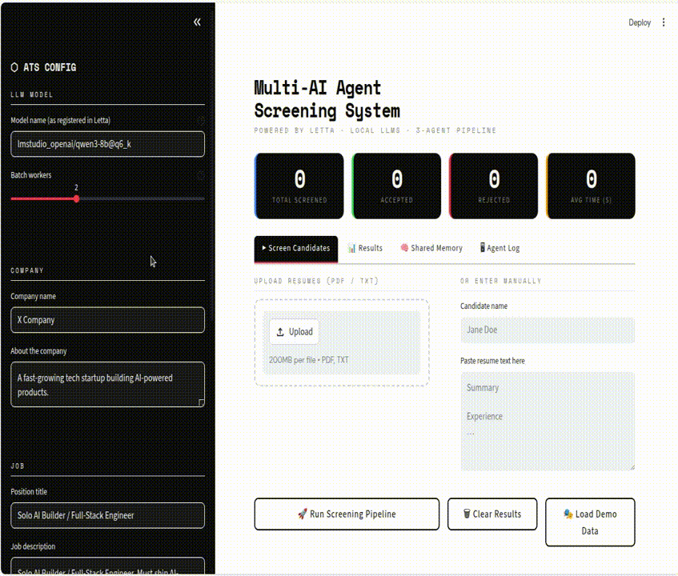

# Multi-AI Agent Resume Screening System

An AI-powered Applicant Tracking System (ATS) built on the [Letta](https://letta.com/) multi-agent framework. Three collaborative agents — **Recruiter**, **Evaluator**, and **Outreach** — share persistent memory blocks to screen resumes, score candidates, and automatically draft personalised acceptance or rejection emails.


## Demo


## Architecture

```
┌─────────────────────────────────────────────────────────┐
│                    Streamlit UI                         │
└────────────────────────┬────────────────────────────────┘
                         │
                    letta-client
                         │
┌────────────────────────▼────────────────────────────────┐
│                  Letta Server (Docker)                  │
│                                                         │
│   ┌──────────────┐      ┌──────────────────────────┐   │
│   │  Eval Agent  │─────▶│     Outreach Agent       │   │
│   │              │      │  (acceptance + rejection  │   │
│   │ scores 1-10  │      │         emails)           │   │
│   └──────┬───────┘      └──────────────────────────┘   │
│          │                                              │
│   ┌──────▼──────────────────────────────────────────┐  │
│   │           Shared Memory Blocks                  │  │
│   │  company    │  candidates log  │  decisions log │  │
│   └─────────────────────────────────────────────────┘  │
│                         │                               │
│                    LM Studio API                        │
│               (local LLM via OpenAI compat.)            │
└─────────────────────────────────────────────────────────┘
```

### Shared Memory Blocks

| Block | Writers | Readers | Purpose |
|---|---|---|---|
| `company` | setup | both agents | Job description, required skills, company info |
| `candidates` | eval agent | — | Running log of all screened candidates |
| `decisions` | eval agent | outreach agent | Accepted candidates with key strengths |

---

## Prerequisites

- Docker
- LM Studio (with a model loaded — tested with `qwen3-8b@q6_k`)
- Python 3.10+
- An existing PostgreSQL service on port `5432` is fine — the setup uses `5435:5432` to avoid conflicts

---

## Step 1 — Configure LM Studio

1. Load your model (e.g. `qwen3-8b@q6_k`)
2. Start the local server
3. **Critical:** go to `Settings → Local Server → Network → Server Host` and change `127.0.0.1` → `0.0.0.0`
4. Restart the LM Studio server
5. Verify it is reachable from outside localhost:

```bash
# Replace with your actual LAN IP
ip route get 1.1.1.1 | grep -oP 'src \K\S+'   # find your IP

curl -s http://192.168.x.x:1234/v1/models | python3 -m json.tool | grep '"id"'
```

> **Why `0.0.0.0`?** The Letta Docker container cannot reach `127.0.0.1` on the host directly. Setting LM Studio to listen on all interfaces makes it reachable via `host.docker.internal`.

---

## Step 2 — Start the Letta Server (Docker)

```bash
docker run -d \
  --name letta-server \
  --add-host=host.docker.internal:host-gateway \
  -v ~/.letta/.persist/pgdata:/var/lib/postgresql/data \
  -p 8283:8283 \
  -p 5435:5432 \
  -e LMSTUDIO_BASE_URL="http://host.docker.internal:1234" \
  letta/letta:latest
```

**Flags explained:**

| Flag | Reason |
|---|---|
| `--add-host=host.docker.internal:host-gateway` | Lets the container reach LM Studio on the host (Linux only) |
| `-v ~/.letta/.persist/pgdata:...` | Persists the PostgreSQL data across container restarts |
| `-p 8283:8283` | Letta REST API |
| `-p 5435:5432` | Exposes internal Postgres on port 5435 to avoid conflict with any existing Postgres on 5432 |
| `LMSTUDIO_BASE_URL` | Tells Letta where to find the LM Studio OpenAI-compatible endpoint |

Wait ~15 seconds for startup, then verify:

```bash
curl -s http://localhost:8283/v1/health
curl -s http://localhost:8283/v1/models/ | python3 -m json.tool | grep '"handle"'
```

You should see handles like `lmstudio_openai/qwen3-8b@q6_k`.

---

## Step 3 — Register the LM Studio Provider (first time only)

If the models list is empty or only shows `letta/letta-free`, register the provider manually:

```bash
curl -s -X POST http://localhost:8283/v1/providers/ \
  -H "Content-Type: application/json" \
  -d '{
    "name": "lmstudio",
    "provider_type": "lmstudio_openai",
    "api_key": "dummy-key",
    "base_url": "http://host.docker.internal:1234"
  }'
```

Then restart the container to trigger model sync:

```bash
docker restart letta-server
sleep 15
curl -s http://localhost:8283/v1/models/ | python3 -m json.tool | grep '"handle"'
```

> **Note:** Provider registration is stored in the persistent volume (`~/.letta/.persist/pgdata`), so you only need to do this once — unless you delete the volume.

---

## Step 4 — Project Setup

```bash
git clone https://github.com/alirezafarzipour/Multi-AI-Agent-Letta.git
cd Multi-AI-Agent-Letta

python3 -m venv venv
source venv/bin/activate

pip install -r requirements.txt
```

---

## Step 5 — Configure the Application

Copy the example env file and fill in your values:

```bash
cp .env.example .env
```

Edit `.env`:

```env
# Letta server address
LETTA_BASE_URL=http://localhost:8283

# Model handle — copy exact value from: curl http://localhost:8283/v1/models/ | grep '"handle"'
LETTA_LLM_MODEL=lmstudio_openai/qwen3-8b@q6_k
LETTA_EMBEDDING_MODEL=letta/letta-free

# LLM endpoint reachable from inside Docker
LETTA_MODEL_ENDPOINT=http://host.docker.internal:1234/v1
LETTA_CONTEXT_WINDOW=8192

# Your company info (pre-fills the Streamlit sidebar)
DEFAULT_COMPANY_NAME=Acme Corp
DEFAULT_COMPANY_DESC=A fast-growing AI startup building products that change how people work.

SCORE_THRESHOLD=6
```

> `LETTA_MODEL_ENDPOINT` must use `host.docker.internal` (not `localhost`) because the Letta server runs inside Docker.

---

## Step 6 — Run

```bash
streamlit run app.py
```

### In the Streamlit sidebar:

1. Fill in **Company**, **Job description**, **Required skills**, **Position title**, and **Recruiter** info
2. Click **⚡ Initialize Agents** — this creates the two agents with shared memory blocks
3. Upload PDF/TXT resumes or use **🎭 Load Demo Data**
4. Click **🚀 Run Screening Pipeline**

---

## Project Structure

```
.
├── app.py                  # Streamlit UI
├── config.py               # Reads settings from .env
├── .env.example            # Template — copy to .env
├── requirements.txt
├── agents/
│   └── ats_agents.py       # Letta agent setup, screening logic, batch processing
├── utils/
│   └── resume_parser.py    # PDF and TXT resume parser
└── data/
    └── resumes/            # Temporary resume files (auto-created)
```

---

## Troubleshooting

### `Failed to connect to OpenAI: Connection error`

The agent was created with the wrong endpoint (`localhost` instead of `host.docker.internal`). Fix it:

```bash
python3 -c "
from letta_client import Letta
client = Letta(base_url='http://localhost:8283')
for a in client.agents.list():
    client.agents.update(
        agent_id=a.id,
        llm_config={
            'model': 'qwen3-8b@q6_k',
            'model_endpoint': 'http://host.docker.internal:1234/v1',
            'model_endpoint_type': 'openai',
            'context_window': 8192,
        }
    )
    print(f'Fixed: {a.name}')
"
```

Then re-initialize agents from the Streamlit sidebar.

### `password authentication failed for user "letta"`

Another PostgreSQL instance is running on port 5432 and conflicting with the container's internal DB. The Docker command in Step 2 already handles this with `-p 5435:5432`. Make sure you are using that exact command (not `--network host`).

### Models list is empty after restart

The provider registration is lost only if the Docker volume was deleted. Re-run Step 3.

### Shared memory blocks stay empty

Memory is updated by the application after each evaluation. If you see empty blocks, make sure you are using the latest `agents/ats_agents.py` (blocks are updated via `client.agents.blocks.update()`).

### `Handle not found` error on Initialize

Run the following to see all available model handles:

```bash
curl -s http://localhost:8283/v1/models/ | python3 -m json.tool | grep '"handle"'
```

Update `LETTA_LLM_MODEL` in your `.env` to match exactly.

---

## Tech Stack

| Component | Technology |
|---|---|
| Multi-agent framework | [Letta](https://letta.com/) v0.16.7 |
| LLM | Local model via LM Studio (OpenAI-compatible API) |
| Embedding | `letta/letta-free` (bundled) |
| UI | Streamlit |
| PDF parsing | pdfplumber + pypdf |
| Database | PostgreSQL (inside Docker) |
